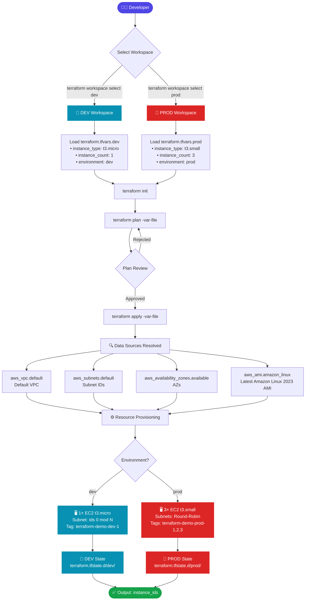

# 🌍 Terraform Multi-Environment Infrastructure

A production-ready Terraform project that provisions **AWS EC2 instances** across multiple isolated environments (`dev` and `prod`) using **Terraform Workspaces**. Each environment is independently managed with its own variable file and state, ensuring clean separation and zero cross-environment risk.

---

## 📋 Table of Contents

- [Overview](#overview)
- [Architecture Flowchart](#architecture-flowchart)
- [Project Structure](#project-structure)
- [Infrastructure Resources](#infrastructure-resources)
- [Environment Configuration](#environment-configuration)
- [Variables Reference](#variables-reference)
- [Prerequisites](#prerequisites)
- [Getting Started](#getting-started)
- [Workspace Workflow](#workspace-workflow)
- [Outputs](#outputs)
- [Best Practices Applied](#best-practices-applied)

---

## 🔭 Overview

This project demonstrates a **multi-environment Terraform pattern** using workspaces. The same codebase provisions infrastructure for both `dev` and `prod` — with environment-specific configurations passed via separate `.tfvars` files.

| Feature | Detail |
|---|---|
| **Cloud Provider** | AWS |
| **IaC Tool** | Terraform |
| **Workspace Strategy** | `dev` · `prod` · `default` |
| **Compute** | Amazon EC2 (Amazon Linux 2023) |
| **Network** | Default VPC + Subnets (auto-discovery) |
| **State Isolation** | Per-workspace local state (`terraform.tfstate.d/`) |
| **AWS Provider Version** | `6.65.0` |

---

## 🗺️ Architecture Flowchart



---

## 📁 Project Structure

```
terraform-multi-environment/
├── main.tf                  # Core infrastructure — provider, data sources, EC2 resources, outputs
├── variables.tf             # Input variable declarations with types and descriptions
├── terraform.tfvars.dev     # DEV environment variable values
├── terraform.tfvars.prod    # PROD environment variable values
├── .terraform.lock.hcl      # Provider version lock file (hashicorp/aws v6.65.0)
├── .gitignore               # Excludes .terraform/, state files, and OS artifacts
└── README.md                # This file
```

---

## 🏗️ Infrastructure Resources

### Data Sources (Auto-Discovered)

| Data Source | Purpose |
|---|---|
| `aws_vpc.default` | Discovers the default VPC in the AWS account |
| `aws_subnets.default` | Fetches all subnets belonging to the default VPC |
| `aws_availability_zones.available` | Lists all available AZs in the selected region |
| `aws_ami.amazon_linux` | Fetches the latest Amazon Linux 2023 AMI (`al2023-ami-*-x86_64`) |

### Resources Provisioned

| Resource | Type | Description |
|---|---|---|
| `aws_instance.app` | `aws_instance` | EC2 instances — count controlled by `var.instance_count` |

**Subnet distribution:** Instances are distributed across subnets using round-robin (`count.index % length(subnets)`), ensuring high availability.

**Tagging strategy:**
```
Name        = "<project_name>-<environment>-<index>"
Environment = "<environment>"
Project     = "<project_name>"
```

---

## ⚙️ Environment Configuration

### DEV Environment (`terraform.tfvars.dev`)

```hcl
environment      = "dev"
project_name     = "terraform-demo"
instance_type    = "t3.micro"      # Cost-efficient for development
instance_count   = 1               # Single instance — no HA needed
aws_region       = "us-east-1"
ami_name_pattern = "al2023-ami-*-x86_64"
```

### PROD Environment (`terraform.tfvars.prod`)

```hcl
environment      = "prod"
project_name     = "terraform-demo"
instance_type    = "t3.small"      # More powerful for production workloads
instance_count   = 3               # 3 instances across subnets for HA
aws_region       = "us-east-1"
ami_name_pattern = "al2023-ami-*-x86_64"
```

### Environment Comparison

| Parameter | DEV | PROD |
|---|---|---|
| Instance Type | `t3.micro` | `t3.small` |
| Instance Count | `1` | `3` |
| High Availability | ❌ | ✅ (Round-Robin subnets) |
| Cost (approx/mo) | ~$8 | ~$48 |
| State File | `tfstate.d/dev/` | `tfstate.d/prod/` |

---

## 📐 Variables Reference

| Variable | Type | Default | Description |
|---|---|---|---|
| `environment` | `string` | — | Environment name (`dev` / `prod`) |
| `project_name` | `string` | — | Project name used in resource tags |
| `instance_type` | `string` | — | EC2 instance type |
| `instance_count` | `number` | — | Number of EC2 instances to launch |
| `aws_region` | `string` | — | AWS region to deploy into |
| `ami_name_pattern` | `string` | `al2023-ami-*-x86_64` | AMI name filter pattern |

---

## ✅ Prerequisites

Before you begin, make sure you have:

- [Terraform](https://developer.hashicorp.com/terraform/install) `>= 1.0` installed
- [AWS CLI](https://aws.amazon.com/cli/) configured with valid credentials
- An AWS account with permissions to create EC2 instances

```bash
# Verify installations
terraform version
aws sts get-caller-identity
```

---

## 🚀 Getting Started

### 1. Clone the Repository

```bash
git clone https://github.com/Ayushsoni9125/Terraform-MultiEnvironment-Infra.git
cd Terraform-MultiEnvironment-Infra
```

### 2. Configure AWS Credentials

```bash
aws configure
# Enter: AWS Access Key ID, Secret Access Key, Region (us-east-1), Output format (json)
```

### 3. Initialize Terraform

```bash
terraform init
```

This downloads the **hashicorp/aws** provider (`v6.65.0`) as locked in `.terraform.lock.hcl`.

---

## 🔄 Workspace Workflow

### List All Workspaces

```bash
terraform workspace list
# Output:
#   default
#   dev
# * prod      ← currently active
```

### DEV Environment

```bash
# Switch to dev workspace
terraform workspace select dev
# (or create it if it doesn't exist)
terraform workspace new dev

# Preview changes
terraform plan -var-file="terraform.tfvars.dev"

# Apply changes
terraform apply -var-file="terraform.tfvars.dev"

# Destroy when done
terraform destroy -var-file="terraform.tfvars.dev"
```

### PROD Environment

```bash
# Switch to prod workspace
terraform workspace select prod

# Preview changes
terraform plan -var-file="terraform.tfvars.prod"

# Apply changes
terraform apply -var-file="terraform.tfvars.prod"

# Destroy when done
terraform destroy -var-file="terraform.tfvars.prod"
```

---

## 📤 Outputs

After `terraform apply`, the following outputs are available:

| Output | Description |
|---|---|
| `instance_ids` | List of all provisioned EC2 instance IDs |

```bash
# View outputs
terraform output instance_ids

# Example output (prod — 3 instances)
# instance_ids = [
#   "i-0a1b2c3d4e5f67890",
#   "i-0b2c3d4e5f6789012",
#   "i-0c3d4e5f678901234",
# ]
```

---

## 🛡️ Best Practices Applied

- ✅ **Workspace-based isolation** — separate state per environment, zero risk of cross-environment changes
- ✅ **No hardcoded values** — all configuration is parameterized via `variables.tf`
- ✅ **Dynamic AMI selection** — always uses latest Amazon Linux 2023, no stale AMI IDs
- ✅ **Round-robin subnet distribution** — instances spread across subnets for availability
- ✅ **Consistent tagging** — `Name`, `Environment`, and `Project` tags on all resources
- ✅ **Provider lock file** — `.terraform.lock.hcl` ensures reproducible builds across machines
- ✅ **State files excluded from git** — state contains sensitive data and is gitignored

---

## 📄 License

This project is open-source and available under the [MIT License](LICENSE).

---

<div align="center">

Made with ❤️ by [Ayush Soni](https://github.com/Ayushsoni9125)

</div>
